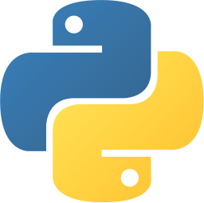
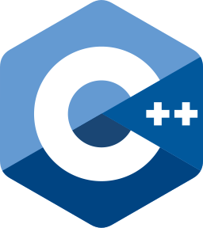

<h2 align="center">Hi, I'm Chucky</h2>
<h4 align="center">I'm a Computer Science student at Kasetsart University.</h4>

<h2>Languages & Frameworks</h2>

    &nbsp;
    &nbsp;
    &nbsp;
    &nbsp;
    &nbsp;
    &nbsp;
    &nbsp;
    &nbsp;

    &nbsp;
    &nbsp;
    &nbsp;
    &nbsp;
    &nbsp;
    &nbsp;
    &nbsp;
    &nbsp;

# 📊 GitHub Stats:
 
 

## 🏆 GitHub Trophies

<!-- Proudly created with GPRM ( https://gprm.itsvg.in ) -->
